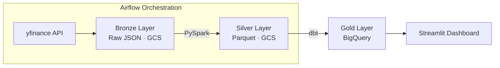

# Market Pulse 📈
### Stock Market Analytics Platform

## Overview
An end-to-end stock data pipeline that ingests, transforms and models market data into Bronze → Silver → Gold architecture for analytics and visualization, built with: Pyspark, Apache Airflow, Google Bigquery, Google Cloud Storage,Streamlit, dbt

## Architecture


## Tech Stack
- **Ingestion:** yfinance, Python
- **Orchestration:** Apache Airflow
- **Storage:** Google Cloud Storage
- **Processing:** PySpark
- **Modelling:** dbt
- **Warehouse:** BigQuery
- **Serving:** Streamlit, Plotly
- **Containerization:** Docker

## Local Setup
### Prerequisites
- Python version 3.12.3
- Java version 11 — required for PySpark
- GCP account with BigQuery and GCS enabled
- ADC configured 

    ```
    gcloud auth application-default login
    ```

- Install all dependencies for pipeline
    ```
    pip install -r requirements.txt
    ```
- Install all dependencies for dashboard
    ```
    pip install -r dashboard/requirements.txt
    ```
### Environment Variables
```
BASE_PATH=/path/to/stock-analytics-platform/data
BRONZE_PATH=${BASE_PATH}/bronze
SILVER_PATH=${BASE_PATH}/silver
BUCKET_NAME=your-gcs-bucket-name
PROJECT_ROOT=/path/to/stock-analytics-platform
```

### dbt Setup
Create `~/.dbt/profiles.yml` with the following configuration:

```yaml
market_pulse:
  outputs:
    dev:
      type: bigquery
      method: oauth
      project: your-gcp-project-id
      dataset: market_pulse_gold
      location: asia-south1
      threads: 4
      job_execution_timeout_seconds: 300
      job_retries: 1
      priority: interactive
  target: dev
```

`method: oauth` uses your ADC credentials — no service account key needed.

### Airflow Setup
- Update `~/airflow/airflow.cfg`:

    `dags_folder = /path/to/stock-analytics-platform/orchestration/dags`

- Initializes Airflow's metadata database (Run once on first setup)
    ```
    airflow db init
    ```
### Running the Pipeline
- Run pipeline using Airflow in Terminal 1
    ```
    airflow scheduler
    ```
- Start Airflow webserver in Terminal 2
    ```
    airflow webserver
    ```
- Trigger the DAG manually from the Airflow UI at `http://localhost:8080`.
## Docker
- Build Docker image (once)
    ```
    docker build -t market-pulse .
    ```
- Run Docker Container
    ```
    docker run -v ~/.config/gcloud:/root/.config/gcloud \
    -e GOOGLE_APPLICATION_CREDENTIALS=/root/.config/gcloud/application_default_credentials.json \
    -p 8501:8501 market-pulse
    ```

## Key Engineering Decisions
- **Medallion Architecture**: Medallion Architecture (Bronze → Silver → Gold) structure was chosen to organize the data into raw, cleaned, and aggregated layers. This makes the pipeline easier to understand and helps in debugging, since issues can be traced back to a specific layer.
- **Pyspark for Transformation**: Used PySpark to simulate how transformations would work in a distributed setup. For the current data size, pandas would be enough, but PySpark makes it easier to scale if the number of stocks or data volume increases later.
- **External tables in BigQuery**: Used external tables in Google BigQuery so the data stays in cloud storage and doesn’t need to be duplicated. This keeps storage costs lower and ensures queries always run on the latest data.
- **dbt for Gold Layer**: Used dbt for transforming Silver data into Gold models. It helps in writing modular SQL, organizing transformations clearly, and adding basic data quality checks like: not_null, accepted_range, etc.
- **Hive partitioning on Bronze/Silver**: Applied partitioning on Symbol column for Silver Layer and on Symbol and Date for Bronze Layer to improve query performance. This reduces the amount of data scanned and makes the pipeline more efficient as data grows.
## Known Limitations
- **Dependency on API Data Quality**: The pipeline depends on data from yfinance. If the API returns incorrect or inconsistent data, it can affect downstream layers. Basic null handling is implemented, but more robust validation can be added.
- **Full Refresh in dbt Models**: Currently, dbt models run as full refresh, which is simple but not efficient for larger datasets. Incremental models would be a better approach as data grows.
- **Local Spark Execution**: PySpark is running in local mode instead of a distributed cluster. This works for the current scale but does not fully utilize Spark’s distributed processing capabilities.
- **Lack of Failure Handling in Pipeline**: If a DAG in Apache Airflow fails midway, partial or inconsistent data may get written to storage, which can lead to incorrect results or errors in downstream layers like Streamlit. Currently, there are no retries configured and no alerting/notification mechanism on failure, so issues need to be monitored manually.


